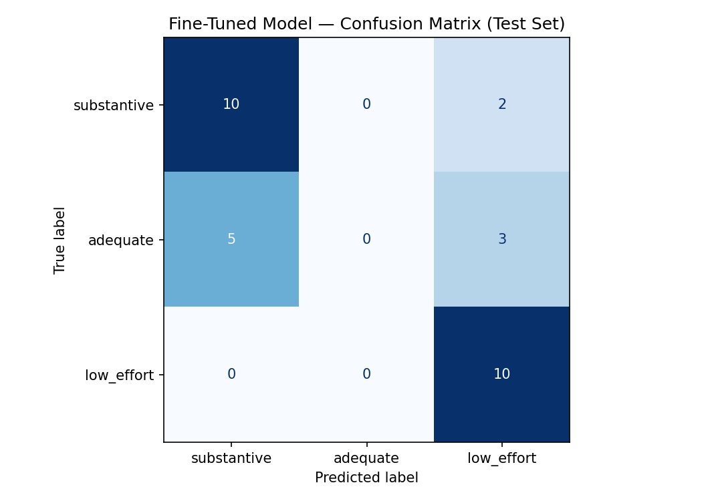

# Takemeter: r/Fantasy
## Community
r/Fantasy is a discussion board for the broader fiction genre: it encompasses all speculative fiction media. I chose r/Fantasy because there are opinions, fantasy reviews, and open-ended discussion questions. Some are more detailed and well thought out; you can learn something from them. And some are less so. These distinctions matter because people prefer to read content that is thoughtful and from someone who is knowledgeable about the genre. There are a good variety of posts and they do tend to fall into ~3 categories excluding news type posts. 

## Labels

1. substantive: Post is detailed, specific, and engaged with the topic. Big conversation starter. Names specific books, authors, and themes; develops a point about them with reasoning or evidence. Substantive cites several details.
2. low_effort: Vague post that is generic and lacking detail. No specific references. Could have been written by anyone not that engaged with the genres. Asks a question or pushes an opinion without supporting reasoning or context. Specific without a point. 
3. adequate: Adequate makes one point and does not go further. Some familiarity with the genre but does not make an argument or add reasoning.

## Substantive: 
#### Two Examples
1.
>I will admit I went into this with a lot of preconceived notions. It's going to be slow, it's going to be dated, it's going to feature a lot of stuff I've already seen because it's so influential. But I went into it intending to give it a proper shot and so damn happy I did.

> The book does start very slow, following the main character, a young scullion named Simon, as he runs around the castle and just takes in all the joys of being a young person. I expected this slowness from the start, but what I didn't expect is that this was honestly the best part of the book, not for the failings of the rest but because Williams manages to capture that joy of youth so damn perfectly even while setting up for the rest of the plot. Simon is curious, adventurous, and mischievous, and through him we get introduced to the beauty of this world.

> Eventually the plot gets rolling and Williams shows you quickly he means business, bringing in some truly nightmarish imagery and starting Simon on a quest first simply to survive, but then to help save the world. He is no chosen one but one of many heroes helping to fight the spreading of a great evil they don't fully understand.

> When the book kicks into adventure it brings constant surprises, as Simon comes across trolls, witches, princesses, and any number of monsters in his journey, slowly growing and maturing as the world takes away room for him more childish desires.

> I cannot recommend this book enough. If you like classic, adventure focused fantasy, this is an absolute must read.
2. 
>Which fantasy authors would you say are the best and worst at writing dialogue?
>Whatever best and worst means depends on you. I think good dialogue is more in service of character than it is plot. You, as an author, have a lot of tools at your disposal to communicate plot to the reader, so dialogue should be written with a character's personality in mind. Using it to remind the reader of what's happening should be secondary to that.

### Low Effort
#### Two Clear Examples
1. 
> John Blanche, the Legendary Illustrator Who Defined the Look of Warhammer 40,000, Has Died
> r/Fantasy - John Blanche, the Legendary Illustrator Who Defined the Look of Warhammer 40,000, Has Died 
2. 
> Recommend me a fantasy book that doesn’t teach me a lesson
> In a bit of a reading lull trying to find my next read. Started Katabasis and then saw something about how it is so profound and teaches a lesson along with the story. That’s great, but coming from the thriller world where it’s just one story after another I’m looking for recommendations for series or standalones that are fantasy but don’t have a profound message at the end.
> Don’t get me wrong I really enjoyed the Wheel of Time and the Stormlight Archive, but I guess I’m looking for something different.
>Sorry if this is insulting to the genre, but just looking for something different for a bit.

### Adequate
#### Two Clear Examples
1.
> What do you know well enough that when it's portrayed wrong you're taken out of the moment?
> I used to shoot traditional archery and was moderately competent, but I read up a LOT on medieval archery. So when I see it done wrong in a movie (once I saw a guy draw a bow and the string stretched!), it kills my suspension of disbelief.
>What is it you know about that writer's, actors, directors get wrong and spoils your enjoyment in the moment?
2. 
> How grim dark is the devils from Abercrombie?
> My only connection with Grimdark content is the lore of Warhammer. It’s a fun backdrop for a tabletop game however I don’t think I would enjoy a novel that’s just a stories about how miserable the world is combined with ultra violent and vicious characters who are amoral for the purpose of edginess.
> Would you recommend Abercrombie to me considering what I just said?

## Data Collection
### Source
- Data was sourced from r/Fantasy manually by me. 
### Labeling
I labeled the data myself. I noticed that the boundaries could be a bit tough but I tried to stick to my rules. 
### Label Distribution
| Label | Number of examples |
| ----- | ---- |
| substantive | 75 |
| low_effort | 68 |
| adequate | 57 |
### 3 Difficult to label posts/texts 
1. **Casual or emotional is not low_effort, if you have detail + opinion it is substantive or adequate:** 
>Just finished The Heroes by Joe Abercrombie for the first time. I hated it, but I loved it. I feel very conflicted about this one, I really did hate and love it.
> I loved the characters, the new and the old set. I appreciated all of the banter, which often made me quite emotional, and all of the scheming.
> But they were all. so. [expletive]. whiny.
> Gorst aggravated me with his loads of self pity, all of the Union did really. The dozen also weren’t easy companions.
> Which just goes to show how much free time you have in war, and how self-centred it makes you, despite everything going on around you.
> I think what I struggled with the most was all of the wait, for things to happen, for the battles, for messages to come and go, for whatever character to come back from taking a [expletive] so the dialogue could go on.
> But that’s also what I loved most about it, we catch a rare glimpse on what battle actually looks like. Of all the dead moments. All the embarrassing ones. All the very non heroic ones. No more comparisons to Juvens, to Harod the Great. Just men trying not to catch the bug while hanging out in the bushes.
>Everything was just, mildly exciting at best. Not in a “oh my god this book has no plot” way, it felt very deliberate, very carefully executed. To me, the plot of the book IS the boredom, which I understand not 
- I labelled the above example substantive because it is detailed beyond obseravation
2. **Unusual or distinctive does not mean substantive:**
> Can someone reccomend a good sci-fi/fantasy with badly written characters/where characters don't matter?
>I've always been a loner in a sense that I have yet to meet a person about whom I would care if they would suffer (unless it materially affects me). Likewise I don't care about human opinions and "inner world" unless it directly affects my material and I don't want people to love me or understand me beyond what's materially necessary. This makes reading fiction, especially the classic one, really hard since most of it is about that petty human drama. I've been reading old sci-fi and fantasy due to it with "bad characters" because no time is wasted on them but with interesting concepts like Lovecraft, Tolkien(Silmarillion), Clark Ashton Smith, Clarke, Asimov, Stapledon, Greg Egan, All Tomorrows, SCP and general hard sci-fi(I'm working in tech). I would love to learn other​ authors and media like that.
- I labeled this adequate. It has observation and is unique but does not expand further.
3. **Length can be misleading**
>I never noticed but Wheel of time protagonists were all derived from Norse Mythology

>Rand as Tyr, Mat as a mixture of Loki and Odin and Perrin as Thor. I just came across the text a few days ago that Tyr's hand was also lost to Fenrir. Mat was also hanging from the tree and had lost an eye, like Odin and was called the Raven Prince.
- The above is short which makes you think it would be low_effort. But since it has detail and makes a claim, it is substantive.

## Baseline
### Prompt
python"""
You are classifying 200 posts from r/Fantasy.
Assign each post to exactly one of the following categories.

substantive: Post is detailed, specific, and engaged with the topic; it names
specific books, authors, and themes, developing a point about them with reasoning or evidence. 
Example: "I will admit I went into this with a lot of preconceived notions. 
It's going to be slow, it's going to be dated, it's going to feature a lot of 
stuff I've already seen because it's so influential.
 But I went into it intending to give it a proper shot and so damn happy I did."

low_effort: Vague post that is generic and lacking detail and specific references;
asks a question or pushes an opinion without supporting reasoning or context.
Example: "Recommend me a fantasy book that doesn’t teach me a lesson"

adequate: Adequate makes one point and does not go further; has some familiarity
 with the genre but does not make an argument or add reasoning.
Example: "Brandon Sanderson is probably the most consistent author in fantasy — 
I've read six of his books and none of them have disappointed me. 
His magic systems are always the highlight. Anyone else feel this way or am I 
missing something?"

Respond with ONLY the label name.
Do not explain your reasoning.

Valid labels:
substantive
low_effort
adequate """

### How I got results
The baseline used Groq's llama-3.3-70b-versatile without any prior training. Each example was passed to the model with the prompt about. Predictions were recorded along with the truth labels. Overall acurracy and per-class metrics were computed and saved.

## Fine-tuning approach
### Base model and training platform
- **Training platform:** Google Colab T4
- **Base model:** distillbert is the base model.

### Hyperparamter decisions
I lowered the learning rate to 1e-5 so that the model would update more slowly and so that low_effort and adequate would balance out by adequate becoming more properly fitted (reduce overfitting). This actually ended up backfiring and the model got worse. The results I have included are from the default parameter run. 

## Evaluation report
### Baseline model
**Baseline Accuracy:** 0.567
**Baseline - Per-Class Scores:**
| Label    | Precision | Recall | F1 Score |
| ----------- | ---------- | -------- | -------- |
|  substantive     |   0.52    |   1.00      |  0.69   |
|    adequate      |     0.00    |     0.00     |   0.00     |
|   low_effort       |    1.00      |    0.57     |   0.50    |

### Fine-tuned Model
**Fine-tuned model accuracy:** 0.667
**Fine-tuned - Per-class Scores**
| Label    | Precision | Recall | F1 Score |
| ----------- | ---------- | -------- | -------- |
|  substantive     |   0.67      |   0.83       |  0.74    |
|    adequate      |     0.00    |     0.00     |   0.00     |
|   low_effort       |    0.67      |    1.00      |   0.80     |
#### Confusion matrix

| True \ Predicted | substantive | adequate | low_effort |
| :--- | :---: | :---: | :---: |
| **substantive** | **10** | 0 | 2 |
| **adequate** | 5 | **0** | 3 |
| **low_effort** | 0 | 0 | **10** |

**Which labels are being confused?**
Adequate was the biggest issue, it was completely misclassified and the model didn't learn it. Adequate v. substantive was the biggest issue. There was some adequate and low_effort boundary problems. And substantive is leaking into low_effort a little bit.

**Why is the boundary hard?**
Adequate vs. substantive is difficult because substantive is just some more detail and actually making a point whereas adequate is an observation that sometimes has detail but does not take things a step forward into making some sort of claim. 

**Is this a labeling problem or a prompt/data problem?**
I think both are a problem. I noticed some labels that were off. And adequate postings are actually a difficult category to find, so were a little less represented in the data (still more than 20% of the dataset though).

**What would I need to change to fix it?**
I would need more adequate examples, a tighter label definition, more labeling accuracy on my part, and more varied examplse. I think the examples didn't cover enough adequate for the model to get the pattern. There was also some noise in the labeling because I made mistakes between adequate vs. substantive.

### Wrong Predictions + Analysis 
1. 
> Text:      Am I the only one who LOVES super long stories with tons of "filler" and thinks all novels/series are WAY too short?
> Alright, I can't be the only one, but I constantly see people say "The book is so ...
> True:      adequate
> Predicted: low_effort  (confidence: 0.34)
- Analysis: The style of the post makes it seem like it is low effort. But they cite some examples and start to make some observations which led to me labeling it adequate
- I can see why the model made this mistake.
2. 
> Text:      People are too sensitive about their favorite authors/books
> Books have plot holes. Authors mess up. Authors also tend to be overly critical of other authors, ignoring their own faults in the process....
> True:      adequate
> Predicted: substantive  (confidence: 0.36)
- Analysis: I actually agree with the model on this one. I think this one was sort of edge case, but since they started to create an argument with reasoning, it should go into substantive. 
3. 
> Text:      Best "First Chapter: Leave your village - Final Chapter: Kill god" books
> This is kind of a weird one but I really like books that start off with the main character being in a local setting with small...
> True:      adequate
> Predicted: low_effort  (confidence: 0.34)
- Analysis: I agree with the model on this one and think it was mislabeled. The post does not make any decent observations.

### Sample-Classifications table

## Reflection: What did the model learn vs. what I had intended it to learn?
There was some annotation noise. I think for a couple of them the model learned well, but the training data was mislabeled. 
## Spec reflection
 - **How it helped:** I was able to clarify my labels properly through the examples and think through evaluation. I also had an idea of what success would look like based on the success metrics defined in the spec. 
 - **How implementation diverged:** I actually intended to scrape reddit, but you have to get approved for the api, so I had to get data myself.

## AI Useage
- I had AI cleanup my dataset when I thought there were bad characters in it. It completed that well, but that was not actually the issue.
- The AI suggested that I try lowering the learning rate, but that actually backfired and the model got worse. So I went back to default params.
